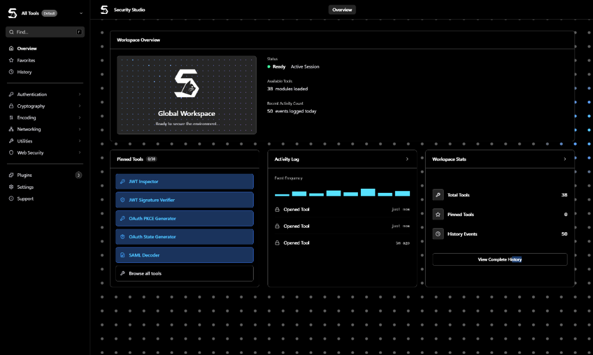

<div align="center">


# Security Studio
### The modern, privacy-first offline workspace for cybersecurity engineers.

[](https://opensource.org/licenses/MIT)
[](https://nodejs.org/)
[](#prerequisites--quickstart)
[](../../releases)

---

**Security Studio** is a self-hosted, offline-ready web-based workspace designed to bundle all the tools a security professional, penetration tester, or developer needs. No telemetry, no cloud dependencies, and absolute data privacy.

*Privacy-first • Manifest-driven • Auto-configuring • Local SQLite • Zero-Account Overhead*

<br />



</div>

---

## 🛠️ The Security Toolset (38 Tools)

Security Studio features exactly 38 specialized tools. Every tool operates strictly client-side, ensuring that your keys, payloads, and tokens never leave your browser. Each tool is equipped with a dedicated **Documentation** tab (rendered from local markdown) and **Examples** loaded instantly into active input panels.

### 🔐 Authentication
*   **JWT Inspector**: Parse, decode, and visually audit header and payload claims.
*   **JWT Verifier**: Decode tokens, verify signatures, and audit payload claims.
*   **OAuth PKCE Generator**: Generate cryptographic code verifiers and SHA-256 code challenges.
*   **OAuth State Generator**: Produce cryptographically secure states for redirection flows.
*   **SAML Decoder**: Decode SAML assertions and responses.
*   **Session Cookie Analyzer**: Inspect cookie structures and report security attributes (Secure, HttpOnly, SameSite).

### 🔒 Cryptography
*   **AES Encrypt/Decrypt**: Encrypt and decrypt payloads symmetrically.
*   **Certificate Viewer**: Parse and inspect X.509 SSL/TLS certificates.
*   **Hash Generator**: Instant MD5, SHA-1, SHA-256, and SHA-512 checks.
*   **HMAC Generator**: Verify message integrity using shared secret keys.
*   **Password Generator**: Generate highly customizable secure passwords.
*   **Password Strength**: Analyze password entropy, length, and estimate crack times.
*   **PEM/DER Converter**: Interconvert between binary DER and ASCII PEM formats.
*   **RSA Key Generator**: Generate 2048-bit or 4096-bit public/private key pairs.

### 🌐 Web Security
*   **CORS Analyzer**: Test CORS configurations for wildcard exposures.
*   **CSP Builder**: Graphically build Content Security Policies.
*   **HTTP Header Diff**: Compare differences between HTTP header configurations.
*   **Security Header Analyzer**: Audit HTTP response headers for missing security guards.

### 🌍 Networking & Registry
*   **ASN Lookup**: Lookup Autonomous System Numbers (ASN).
*   **CIDR Calculator**: Map subnets, calculate IP ranges, and get network sizes.
*   **DNS Lookup**: Resolve DNS zones (A, AAAA, CNAME, MX, TXT) proxied locally.
*   **IP Utilities**: Inspect local network addresses, headers, and geolocation contexts.
*   **WHOIS / RDAP Lookup**: Authoritative WHOIS registrar records query. Features an **automatic TCP Port 43 socket fallback** if public RDAP APIs return `403 Permission Denied` blocks.

### 📝 Encoding & Formatting
*   **Base64 Converter**: Base64 encode/decode textual and binary values.
*   **Binary Converter**: Text-to-binary and binary-to-text conversions.
*   **Hex Encode/Decode**: Hexadecimal encoding and decoding.
*   **HTML Entity Converter**: Interconvert between HTML entities and character outputs.
*   **ROT13 Converter**: Basic Caesar cipher utility supporting arbitrary shifts.
*   **Unicode Converter**: Convert code points to readable characters.
*   **URL Encode/Decode**: Encode string parameters safely for URL injection.

### 🧰 Utilities
*   **Cron Expression Parser**: Parse crontab expressions into readable schedules.
*   **JSON Diff**: Match structural and value differences between JSON objects.
*   **JSON Formatter**: Format, minify, and validate JSON strings.
*   **Regex Playground**: Test regular expressions against text inputs.
*   **Timestamp Converter**: Convert Epoch timestamps to readable UTC/Local datetimes.
*   **UUID Generator**: Generate cryptographically random UUIDs (v4).
*   **XML Formatter**: Format, pretty-print, and minify XML inputs.
*   **YAML ↔ JSON Converter**: Convert structures between YAML and JSON layouts.

---

## 📁 Workspaces & Audit History

Security Studio organizes your security audits through a workspace management system.
*   **Project isolation**: Group relevant tools together under a dedicated "Workspace" folder (e.g., *External Audit*, *Internal Pentest*) for focused access.
*   **Persistent Audit History**: Your tool inputs, configurations, and outputs are logged locally into an SQLite database. You can review past calculations at any time, reload past inputs, or clear the history index.
*   **Settings & Exporting**: Export all workspace files, settings, and database tables in a single JSON schema for backup, or secure-wipe the database with the database reset command.

---

## 🔌 VM Sandbox Plugin Engine

Expand Security Studio by writing custom plugins. Drop any plugin directory into the `/plugins` folder, and the application loads it dynamically.
*   **Logical Isolation**: Plugins run inside a secure backend Node.js `vm` sandbox context, protecting the host server from malicious scripts.
*   **Granular Permissions Badging**: Every plugin is assigned visibility badges depending on the resources declared in its manifest:
    *   🟢 **Safe**: Basic sandbox operations, local storage, history logging, and internal event-bus access.
    *   🟡 **Sensitive**: Direct local filesystem access or network calls.
    *   🔴 **Dangerous**: *Future expansion* — Shell command executions or system process spawns.
*   **Manifest & Live Logs**: Click **Manifest** to inspect the plugin configuration or **Logs** to view console outputs emitted by the plugin inside the sandbox in real-time.

---

## ⚙️ Prerequisites & Quickstart

### Prerequisites
1.  **Node.js**: Version `20.0.0` or higher installed on your host machine.
2.  **Git**: Installed (to clone the codebase).
3.  *(Optional)* **Windows OS** to use the one-click startup batch script.

---

### 🚀 Windows Startup (One-Click)
We bundle a `start.bat` script in the root directory to automate startup on Windows:
1.  Double-click the **`start.bat`** file.
2.  The script will:
    *   Check for Node.js and npm path variables.
    *   Inspect your environment and run `npm install` automatically if `node_modules` are missing.
    *   Connect to the local SQLite database.
    *   Launch the API and Vite dev servers concurrently.
3.  Open **`http://localhost:3000`** in your browser!

---

### 💻 Manual CLI Startup (Any OS)
For macOS, Linux, or custom CLI launches:

```bash
# 1. Clone the repository
git clone https://github.com/SoraPewnaldo/Security-Studio.git
cd Security-Studio

# 2. Install dependencies (triggers Prisma DB generation)
npm install

# 3. Spin up the workspaces
npm run dev
```

The SQLite database is auto-created in the `/data` folder, and the dev server spins up. Open `http://localhost:3000` in your web browser.

---

## 🎨 Adding a Custom Tool

Security Studio operates on a **manifest-driven architecture**. To add a new tool:

1. Create a folder in `apps/web/src/features/<category>/<tool-id>/`:
    ```text
    my-tool/
    ├── manifest.ts    # Tool metadata (name, tags, examples)
    ├── Tool.tsx       # React Component (UI)
    ├── logic.ts       # Processing functions
    ├── schema.ts      # Input schema validations
    └── README.md      # Tool documentation
    ```
2. Save your changes. The glob resolver in `src/features/register-tools.ts` will automatically register the manifest and component, rendering it in the Search Index, Sidebar, and Command Palette.

---

## 📄 License

Distributed under the MIT License. See [LICENSE](LICENSE) for more information.
