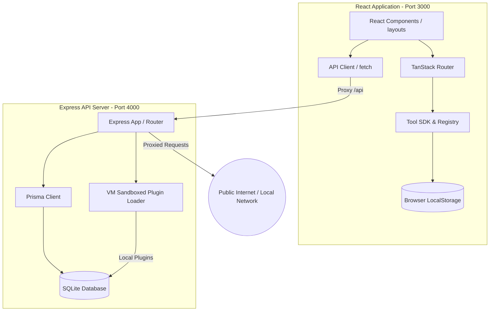

# Architecture & Design System

Security Studio is built on a modular, offline-ready, manifest-driven monorepo structure. This document outlines the system architecture, directory topology, and logical components of the platform.

---

## Technical Stack Overview

*   **Monorepo Manager**: NPM Workspaces
*   **Frontend**: React 19, Vite 6, Tailwind CSS v4, TanStack Router (Typesafe Routing), TanStack Query
*   **Backend**: Express 5, Prisma ORM, SQLite Database
*   **Security Isolation**: Node.js `vm` sandbox context for third-party plugins

---

## Logical System Architecture



---

## Key Architectural Boundaries

### 1. Manifest-Driven Tool Registry
Tools are fully decoupled. The core React layout does not import or list tools manually.
*   **Registration**: Vite scans folders dynamically at build time using the glob query:
    ```typescript
    import.meta.glob('./**/*/manifest.ts', { eager: true });
    ```
*   **Decoupling**: A tool is self-contained. Deleting its directory removes it cleanly from the sidebar, search index, and routes without breaking any other imports.

### 2. Workspace & History System
*   **Local State**: Workspace switches, UI configurations, and Playbook progress are cached in the browser's `LocalStorage` for instantaneous loads.
*   **Persistent State**: Tool run inputs and outputs are recorded via the backend API.
*   **Database**: SQLite (`security-studio.db`) stores workspace settings and audits offline.

### 3. Outbound Network Proxying
Many security tools require network access (e.g., DNS zone queries, WHOIS queries, HTTP headers).
*   **Bypassing Browser CORS**: The frontend routes these calls to `/api/networking/*`.
*   **Local Fallback**: The backend uses raw sockets (TCP Port 43) to query WHOIS registrars directly when HTTP-based RDAP endpoints block requests.
*   **Bypassing SSFR Checks**: Local targets (`localhost`, `127.0.0.1`, Docker subnets) are fully supported and route transparently through the Node proxy server.

### 4. VM Sandbox Plugin Loader
Third-party plugins are loaded into an Express middleware sandbox context.
*   **Vulnerability Isolation**: Plugins execute inside the Node `vm` context with access restrictions on dangerous APIs.
*   **Console Interception**: Logs are piped back to the database in real-time for viewing in the plugins manager panel.
